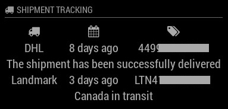

# MMM-ShipmentTracking
Shipment Tracking Module for MagicMirror<sup>2</sup>

## Example

|  |  |

## Dependencies
  * An installation of [MagicMirror<sup>2</sup>](https://github.com/MichMich/MagicMirror)
  * npm
  * [jsdom](https://www.npmjs.com/package/jsdom)
  * [async](https://www.npmjs.com/package/async)

## Installation
 1. Clone this repo into `~/MagicMirror/modules` directory.
 2. Run command `npm install` in `~/MagicMirror/modules/MMM-ShipmentTracking` directory, to install all dependencies. This will need a couple of minutes.
 3. Configure your `~/MagicMirror/config/config.js`:
 
     ```
     {
         module: 'MMM-ShipmentTracking',
         position: 'top_right',
         config: {
            tracking: {
                DHL: ['0123456789123']
            },
            ...
         }
     }
     ```

## Available carriers
  * [DHL]() (tested with german tracking id, maybe it's worldwide')
  * [Landmark]()

## Config Options
| **Option** | **Default** | **Description** |
| --- | --- | --- |
| `tracking` | REQUIRED | Object of carriers with array of tracking ids |
| `format` | `false` | Displays relative date format, for absolute date format provide a string like `'DD:MM HH:mm'` [All Options](http://momentjs.com/docs/#/displaying/format/) |
| `updateInterval` | `'magic mirror'` | Keyword the mirror starts to listen. |